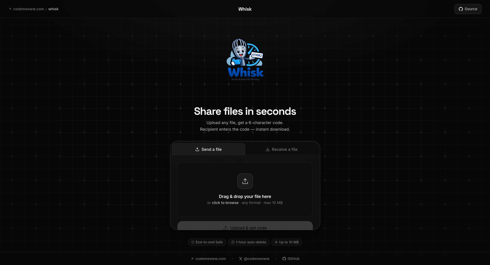

<div align="center">
<h1>
Whisk 🐱
</h1>

[](https://opensource.org/licenses/MIT)
[](https://cloudflare.com)
[](https://react.dev)




<p><strong>The minimalist, high-performance file-sharing platform built on the edge.</strong></p>

Whisk utilizes Cloudflare Workers, R2, and D1 to provide sub-millisecond latency for ephemeral file sharing.

Features a built-in "Janitor" system for automated secure cleanup.

[🌐 Live Demo](https://whisk.codemeoww.com)  • [🤝 Contributing](./CONTRIBUTING.md) • [𝕏 Follow Us](https://x.com/codemeoww)

</div>

## ✨ Features

- ⚡ **Edge-First Architecture**: Deployed on Cloudflare Workers for global low-latency.
- 🧹 **Smart Expiration**: Automated cleanup via stateful Durable Object-based "Janitor" logic.
- 📦 **R2 Storage**: Direct, secure object storage for high-speed file delivery.
- 🛡️ **Rate Limiting**: Stateful protection from automated abuse using Durable Objects.

## 📦 Installation

### 📥 Local Setup (Bun)

```bash
git clone https://github.com/himanshujain112/whisk.git
cd whisk
bun install
```

<details>
<summary><b>⚙️ Environment Configuration</b></summary>

Create a `backend/.dev.vars` file:

```env
TURNSTILE_SECRET_KEY=0x4AAAAAA...your_secret
```

Add your Turnstile site key to frontend environment variables.

</details>

### 🚀 Running Dev

```bash
bun run dev
```

## 🙋‍♂️ How to Use

Whisk uses Hono's RPC feature for end-to-end type safety.

<details>
<summary><b>📤 File Upload Example</b></summary>

```typescript
import { hc } from 'hono/client'
import type { AppType } from 'backend'

const client = hc<AppType>(import.meta.env.VITE_API_URL)

const uploadFile = async (file: File) => {
    const res = await client.upload.$post({ form: { file } })
    return await res.json()
}
```

</details>

<details>
<summary><b>🧹 Automated Expiry Logic</b></summary>

Whisk schedules deletions automatically:

1. Durable Object triggers an alarm at expiry time
2. Record is deleted from Cloudflare D1
3. Object is purged from Cloudflare R2

</details>

## 📋 Tech Stack

| Component | Technology |
|-----------|-----------|
| Frontend | React + Vite + Tailwind CSS |
| Backend | Hono (Cloudflare Workers) |
| Database | Cloudflare D1 (SQLite) |
| Storage | Cloudflare R2 (S3-Compatible) |
| State Management | Durable Objects |

## 📦 Deployment

<details>
<summary><b>Worker Deployment</b></summary>

```bash
cd backend && bunx wrangler deploy
```

</details>

<details>
<summary><b>Pages Deployment</b></summary>

```bash
cd frontend
bun run build
bunx wrangler pages deploy ./dist --project-name whisk-web --branch main
```

</details>

## 🤝 Contributing

Contributions are welcome! See [CONTRIBUTING.md](./CONTRIBUTING.md) for guidelines.

## 🙏 Support

- [🌐 Visit Whisk](https://whisk.codemeoww.com)
- [𝕏 Follow @codemeoww](https://x.com/codemeoww)
- ⭐ Star this repository if you find it useful!

<div align="center">
Built with 🖤 by <a href="https://github.com/himanshujain112">Himanshu Jain</a>
</div>w